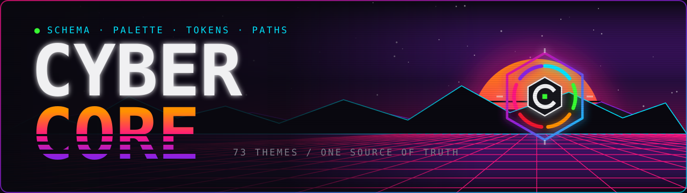

<p align="center">
  
</p>

<p align="center">
  <a href="https://cybercore-tech.github.io/cybercore/">Live theme gallery & docs →</a>
</p>

[](https://crates.io/crates/cybercore)
[](https://crates.io/crates/cybercore)
[](https://docs.rs/cybercore)

The master definition repository and underpinning system engine of the
Cybercore Systems Framework. The single source of truth for global
configuration schemas, the CYBERGRID color palette, and canonical
filesystem paths shared across every downstream project — cyberdeck,
cyberdock, cyberterm, cyberplug, omniscient, and whatever comes next.

## The actual source of truth

**`schema/cybergrid.json`** — not any Rust source file. This is
deliberate: JSON is readable by every language in the framework, not
just Rust. cyberdock's C++/QML can load it directly at runtime with
Qt's `QJsonDocument`; Rust projects get it embedded at compile time
(below) for zero runtime cost and zero drift risk.

Everything else in this repo is a typed loader for that one file, not
an owner of the data. **Edit the JSON. Never hand-edit palette values
or paths anywhere else.**

## Tool status (feature `status`) — since v0.6.0

Every Cybercore tool can publish one JSON status snapshot for the TUI hub and
the Omarchy HUD to read:

```toml
[dependencies]
cybercore = { version = "0.6", features = ["status"] }
```

```rust
use cybercore::status::{self, Health, ToolStatus};

let snapshot = ToolStatus {
    tool: "sigilward".into(),
    version: env!("CARGO_PKG_VERSION").into(),
    health: Health::Watch,
    summary: "2 files drifted".into(),
    ..ToolStatus::default()
};
status::write(&snapshot)?; // atomic: readers never see partial JSON
```

Files go to `$XDG_RUNTIME_DIR/cybercore/<tool>.json` (falling back to
`~/.local/state/cybercore/status/`). The contract is `schema/status.json`.

## Design tokens (fonts, sizing, spacing) — since v0.3.0

Colours are `cybergrid.json`. **Everything else about the feel** — font
families, a type scale, spacing, radii, motion, z-index — lives in
**`css/cybertokens.css`** (with a `schema/tokens.json` mirror for
non-CSS consumers).

```rust
// a ready-to-serve :root {} stylesheet
let css = cybercore::tokens::CSS;
```

Load order in any project: `reset → cybertokens.css → theme colours →
components`. Every Cybercore surface pulls the same `--font-mono`,
`--fs-*`, `--space-*`, `--radius-*` so a new site or tool matches the
rest without copy-paste.

## CYBERGRID theme engine — since v0.6.0

The `cybercore::theme` module turns the embedded palette collection into a
shared runtime catalog. It keeps the existing eleven color roles for current
apps, adds optional light appearance variants and validated design tokens,
and stores user themes outside the binary so every Cybercore app can use them.

```rust
use cybercore::theme::{Appearance, ThemeCatalog};

let mut themes = ThemeCatalog::load()?;
let active = themes.get(themes.active_id()).expect("active theme");
let css = active.document.to_css(themes.active_appearance());
themes.select("tokyo-night")?;
```

Theme documents are portable JSON: they include a stable id, metadata,
palette, optional `variants.light`, and typography/density/corners/motion
settings. Legacy flat palette JSON remains importable. Custom themes are saved
under `$XDG_CONFIG_HOME/cybercore/themes/` (or `~/.config/cybercore/themes/`);
set `CYBERCORE_CONFIG_DIR` to override the shared config root. The selected
theme and dark/light appearance are recorded in `active-theme.json`.

The Hub exposes the shared catalog through its theme picker. The standalone
creator is the `cybercore-theme-studio` workspace package; run it with
`cargo run -p cybercore-theme-studio` for JSON import/export, contrast
feedback, and shared persistence. See
[`docs/theme-engine.md`](docs/theme-engine.md) for the document contract,
storage rules, API, and integration notes.
Studio provides live previews, per-appearance contrast feedback, stable-ID
editing for custom themes, and **Duplicate as new** to safely derive themes
from built-ins or existing custom themes. Imports remain drafts until saved;
built-in themes cannot be overwritten. The Studio uses the active CYBERGRID
palette for its own interface, groups themes into editable family packs, and
accepts both color-picker and direct hex input for each semantic color.
Theme families can be exported as portable `.cyberpack.json` bundles and
installed together with validation and explicit collision policies.

## For Rust projects

Add as a dependency:

```toml
[dependencies]
cybercore = "0.6"
```

Requires Rust 1.85 or newer. For local development against an unpublished
change, use a `[patch.crates-io]` entry instead of committing a `path`
dependency, so the project still builds from a clean checkout.

Then:

```rust
use cybercore::palette;
use cybercore::paths;

println!("{}Hello{}", palette::acid_green(), palette::RESET);
let sysops = paths::sysops_root(); // ~/.sysops, expanded
```

The JSON is embedded into your binary via `include_str!` at compile
time — no runtime file dependency, and the exact schema version your
binary was built against travels with it.

## For C++/QML projects (cyberdock)

Load `schema/cybergrid.json` directly:

```cpp
QFile file(":/cybercore/schema/cybergrid.json");
file.open(QIODevice::ReadOnly);
QJsonDocument doc = QJsonDocument::fromJson(file.readAll());
QString acidGreen = doc["palette"]["acid_green"].toString();
```

Or in QML, since JSON is just JS object syntax:

```qml
property var cybergrid: JSON.parse(cybergrid_json_string)
color: "#" + cybergrid.palette.acid_green
```

(Wiring the actual file into a Qt resource bundle or reading it from a
known filesystem path is left to cyberdock's own build — this repo
just guarantees the JSON's shape and location.)

## Schema

```json
{
  "schema_version": 1,
  "palette": {
    "bg": "0e091d",
    "acid_green": "c8e967",
    "hot_pink": "FD3E6A",
    "purple": "9147a8",
    "cyan": "14B9B5",
    "orange": "FF7F41",
    "red": "f93d3b",
    "white": "ffffff"
  },
  "paths": {
    "sysops_root": "~/.sysops",
    "cargo_target_root": "~/.cargo-target",
    "arch_sys_root": "~/.arch-sys",
    "omarchy_config_root": "~/.config/omarchy"
  }
}
```

Hex values have no leading `#` (each consumer prepends what it needs —
a `#` for CSS/QML, nothing for raw RGB parsing). Paths use `~/` for
home-relative locations; `cybercore::paths` expands this for Rust
consumers.

## Versioning

`schema_version` bumps on any breaking change to the JSON's shape
(renaming or removing a field). Adding a new field is non-breaking —
consumers using an older `cybercore` crate version simply won't see
the new field yet, nothing errors.

Tag releases (`v0.1.0`, `v0.2.0`, ...) so downstream `Cargo.toml`
dependencies can pin to a known-good version rather than tracking
`main` directly.

## Layout

    schema/cybergrid.json   — the actual source of truth
    src/lib.rs               — module declarations
    src/schema.rs            — embeds + parses the JSON once per process
    src/theme.rs             — versioned themes, shared catalog, validation + CSS
    src/palette.rs           — true-color ANSI helpers + raw hex accessor
    src/paths.rs              — canonical filesystem locations, ~-expanded

## Adding to the schema

1. Add the field to `schema/cybergrid.json`
2. Add the matching field to the relevant struct in `src/schema.rs`
3. Expose it through `src/palette.rs` or `src/paths.rs` (or a new
   module, if it's a new category of shared data)
4. Every Rust project depending on this crate picks it up on their
   next `cargo update` + rebuild. Non-Rust consumers see it the next
   time they read the JSON.

## License

MIT
